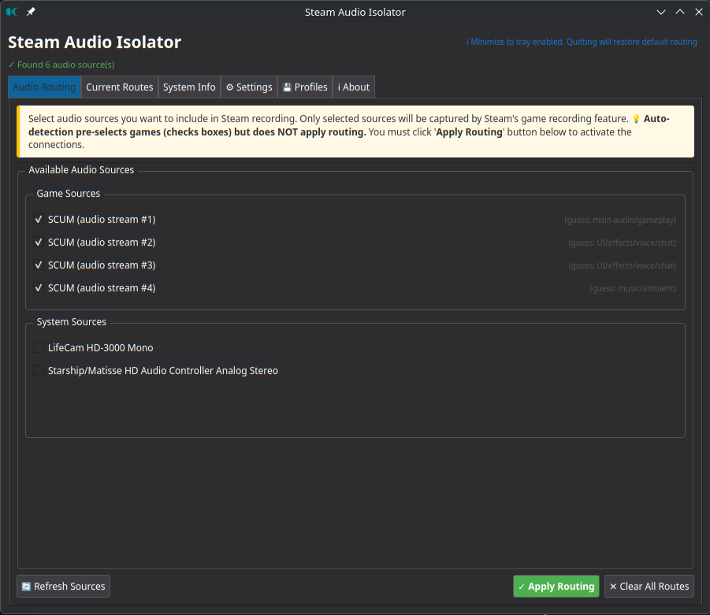

# Steam Audio Isolator

<p align="center">
  
</p>

<p align="center">
  <strong>Isolate game audio for clean Steam Game Recording on Linux</strong>
</p>

<p align="center">
  <a href="#the-problem">The Problem</a> •
  <a href="#features">Features</a> •
  <a href="#installation">Installation</a> •
  <a href="#quick-start">Quick Start</a> •
  <a href="#tabs">Application Tabs</a> •
  <a href="#troubleshooting">Troubleshooting</a>
</p>

---

## The Problem

**Steam Game Recording** on Linux captures **all system audio** by default—everything playing through your speakers gets recorded:

❌ System notifications  
❌ Browser audio (YouTube, Spotify, etc.)  
❌ Discord/chat applications  
❌ Background applications  

This results in cluttered recordings with unwanted sounds mixing into your gameplay footage.

## The Solution

**Steam Audio Isolator** creates **direct audio connections** from your game to Steam Game Recording's input, completely bypassing the system audio mixer:

```
❌ WITHOUT Steam Audio Isolator:
   Game → Audio Sink (speakers) → Steam Game Recording
       ↳ Browser, Discord, notifications also recorded

✓ WITH Steam Audio Isolator:
   Game → Direct Connection → Steam Game Recording
   Other Audio → Speakers (not recorded)
```

## Features

### Core Functionality
- 🎮 **Automatic Game Detection** - Detects Wine/Proton and native Linux games
- 🎯 **Intelligent Categorization** - Automatically classifies audio sources:
  - **Games**: Wine, Proton, native executables
  - **Browsers**: Firefox, Chrome, Chromium, Brave, Vivaldi, Edge, Safari
  - **Communication**: Discord, Slack, Zoom, Telegram, Teams, Skype
  - **System**: ALSA, PulseAudio, notification daemons
  - **Applications**: Everything else
- 🔗 **Direct Audio Routing** - Creates point-to-point PipeWire connections, bypassing the audio sink
- 🎵 **Multi-Stream Support** - Handles games with multiple audio streams (main, UI, voice)
- 💾 **Profile Management** - Save and load routing configurations for quick switching

### User Interface
- 📊 **Routes Visualization Diagram** - See your audio routing connections in real-time
  - 2-column grid layout with source icons and numbered badges
  - Curved connection lines to Steam Game Recording
  - Real-time updates as you apply/clear routes
- 🪟 **System Tray Integration** - Minimize to tray with custom cyan icon
- 🔄 **Real-Time Updates** - Auto-detects new audio sources every 3 seconds
- 📋 **Tabbed Interface**:
  - Audio Routing (source selection)
  - Current Routes (active connections with diagram)
  - System Info (node IDs and properties)
  - Settings (behavior configuration)
  - Profiles (save/load configurations)
  - About (help and information)

### Configuration & Settings
- ⚙️ **Flexible Settings**
  - Auto-detect interval (how often to check for new audio sources)
  - Restore default on close (reconnect audio sink when quitting)
  - Minimize to tray vs. close behavior
- 🎨 **Stream Purpose Detection** - Identifies main audio vs. UI sounds vs. voice chat
- 🚀 **Auto-Apply Routing** - Automatically routes newly detected games

## Screenshots

<p align="center">
  
  <br><em>Main window showing a game with multiple audio channels (auto-detected and selected), Vivaldi browser with video playback, and system audio sources</em>
</p>

<p align="center">
  
  <br><em>Visual routing diagram showing direct connections from game audio channels to Steam Game Recording</em>
</p>

<p align="center">
  
  <br><em>Settings panel with icon cache management - preload and cache all 83 installed Steam games</em>
</p>

<details>
<summary>Click to see routing comparison in qpwgraph</summary>

<p align="center">
  
  <br><em>qpwgraph before routing - all audio flows through the default sink (speakers), including game audio, browser, and system sounds</em>
</p>

<p align="center">
  
  <br><em>qpwgraph after routing - game audio has direct connections to Steam Game Recording input, bypassing the sink. Browser and system audio remain on speakers (not recorded)</em>
</p>

</details>

## Installation

### Option 1: Download Standalone Binary (Recommended)

**No Python installation required!** Just download and run.

1. Go to [Releases](https://github.com/crashman79/steam-audio-isolator/releases)
2. Download `steam-audio-isolator-linux-x86_64.tar.gz`
3. Extract and install:
   ```bash
   tar -xzf steam-audio-isolator-linux-x86_64.tar.gz
   cd steam-audio-isolator-linux-x86_64
   ./install.sh
   ```
4. Launch from application menu or terminal: `steam-audio-isolator`

### Option 2: Run from Source

```bash
git clone https://github.com/crashman79/steam-audio-isolator.git
cd steam-audio-isolator
python -m venv .venv
source .venv/bin/activate
pip install -r requirements.txt
python -m steam_pipewire.main
```

### Option 3: Build Standalone Binary (For Developers)

```bash
git clone https://github.com/crashman79/steam-audio-isolator.git
cd steam-audio-isolator
pip install -r requirements.txt pyinstaller
chmod +x build_release.sh
./build_release.sh

# Release tarball will be in dist/
```

### Requirements

- **Linux** with PipeWire audio system (not PulseAudio)
- **Python 3.8+** (if running from source)
- **Steam** with game recording enabled
- PipeWire tools: `pw-cli`, `pw-dump` (usually pre-installed)

**Verify PipeWire is running:**
```bash
systemctl --user status wireplumber
which pw-dump pw-cli
```

---

## Quick Start

### Step 1: Start the Application
- Launch from application menu or terminal: `steam-audio-isolator`
- App auto-detects all PipeWire audio sources

### Step 2: Select Audio Sources
1. Go to **Audio Routing** tab
2. Game sources are auto-detected and auto-selected
3. **Uncheck** system, browser, and other non-game sources
4. See your selection highlighted in the list

### Step 3: Apply Routing
1. Click **"✓ Apply Routing"** button
2. Watch the **Current Routes** tab update in real-time
3. You'll see the routes visualization diagram show your connections

### Step 4: Start Recording in Steam
1. Press Steam's recording hotkey (default: **Ctrl+F11**)
2. Only your selected game audio is captured!
3. Verify in the **Current Routes** tab that connections are active

### Step 5: When Done
- Click **"✕ Clear All Routes"** to disconnect
- App restores default routing (if "Restore default on close" is enabled)

---

## Application Tabs

### Audio Routing Tab
- **Source List**: Displays all detected audio sources grouped by type (Game, Browser, System, Communication, Application)
- **Checkboxes**: Select which sources to route to Steam
- **Buttons**: 
  - "✓ Apply Routing" - Create selected routes
  - "✕ Clear All Routes" - Disconnect all routes
- **Auto-select**: Games are automatically selected when detected
- **Status**: Shows total sources found and current selection

### Current Routes Tab
- **Routes Visualization Diagram**: 
  - Grid layout showing your audio sources
  - Real-time connection lines to Steam Game Recording
  - Numbered badges (#1, #2, etc.) for multiple sources
  - Source icons extracted from game/app binaries
- **Routes List**: Text listing of all active connections
- **Refresh Routes Button**: Update the display if routes change externally

### System Info Tab
- **Node IDs and Details**: Shows node IDs, names, and properties for debugging
- **Useful for**: Understanding PipeWire structure, diagnosing issues
- **Technical**: Shows application names, binaries, media classes

### Settings Tab
- **Restore default on close**: When enabled, disconnects game routes and reconnects audio sink on exit
- **Auto-detect interval**: How often (in seconds) to check for new audio sources
- **Minimize to tray**: Controls minimize behavior

### Profiles Tab
- **Save Profile**: Create a named profile with your current routing selection
- **Load Profile**: Quickly restore a saved configuration
- **Delete Profile**: Remove a profile you no longer need
- **Storage**: Profiles stored in `~/.config/steam-audio-isolator/profiles/`

### About Tab
- **Version Info**: Current application version
- **Usage Guide**: Quick reference for common tasks
- **Repository Link**: Link to GitHub project

---

## How It Works

### Detection & Categorization
The app analyzes each PipeWire node's properties to categorize sources:

1. **Check process binary** (wine, proton, firefox, etc.)
2. **Check application name** (Discord, Slack, Zoom, etc.)
3. **Check media class** (Stream/Output/Audio = audio producer)
4. **Exclude system nodes** (dummy drivers, echo cancellation, ALSA, Pulse)

### Routing
When you click "Apply Routing":

1. Finds the Steam recording node (auto-discovered)
2. Removes any existing audio sink → Steam connections (to prevent double-recording)
3. Creates direct **game audio → Steam** connections using `pw-cli create-link`
4. System audio continues to speakers normally
5. Updates the visualization diagram in real-time

### Cleanup
When you click "Clear All Routes":

1. Disconnects all game audio from Steam
2. Optionally reconnects the audio sink (for default behavior)
3. All audio returns to speakers

---

## Technical Details

### Source Detection
- **Games**: Detects Wine, Proton executables and native Linux games
- **Browsers**: Firefox, Chrome, Chromium, Opera, Brave, Edge, Vivaldi, Safari
- **Communication**: Discord, Slack, Zoom, Telegram, Teams, Skype, Mumble, TeamSpeak
- **System**: System daemons, notification systems
- **Filtering**: Automatically excludes echo-cancel nodes, dummy drivers, internal systems

### Node Structure
- **Audio Sink** (e.g., Node 66): Your speaker/headphone hardware
- **Game Node** (e.g., Node 137): Audio output from your game
- **Steam Node** (e.g., Node 154): Steam's recording input

### Why Direct Routing Works
- ✓ Selective: Only chosen sources connect to Steam
- ✓ Dual playback: Game audio goes to speakers AND Steam simultaneously
- ✓ Clean: No system audio in your recording
- ✓ Reversible: Easy to restore default routing anytime
- ✓ Real-time: Changes take effect instantly

### PipeWire Commands Used
```bash
pw-dump                              # Query all nodes and connections
pw-cli create-link                   # Create audio routing connection
pw-cli destroy <link_id>             # Remove routing connection
pw-cli list-objects Link             # View active connections
```

### Configuration Storage
```
~/.config/steam-audio-isolator/
├── settings.json                    # Application settings
└── profiles/
    ├── game-only.pwp               # Saved routing profiles
    ├── game-discord.pwp
    └── ...

~/.cache/steam-audio-isolator.log   # Debug logs
```

---

## Troubleshooting

### "Steam node not found"
**Cause**: Steam's recording input isn't detected  
**Solutions**:
- Ensure Steam is running
- Enable **Game Recording** in Steam settings for your game
- Verify PipeWire is running: `systemctl --user status wireplumber`
- Check Steam node exists: `pw-dump | grep -i steam`
- Click **Refresh Sources** in the app

### "No audio sources detected"
**Cause**: Game not started or PipeWire issue  
**Solutions**:
- Start your game **before** launching the app
- Check PipeWire is running: `systemctl --user status wireplumber`
- Verify tools are installed: `which pw-dump pw-cli`
- Click **Refresh Sources** (F5) button
- Check logs: `~/.cache/steam-audio-isolator.log`

### Routes not appearing in "Current Routes"
**Solutions**:
- Click **Refresh Routes** button in Current Routes tab
- Check **System Info** tab for node IDs
- Verify with: `pw-cli list-objects Link`

### Audio still being captured (unwanted sources)
**Problem**: System sounds or browser audio in recording  
**Solution**:
1. Go to **Audio Routing** tab
2. Uncheck any system, browser, or non-game sources
3. Keep only game sources checked
4. Click **Apply Routing** again

### Game audio plays but doesn't record in Steam
**Solutions**:
- Press Steam's recording hotkey (default: **Ctrl+F11**)
- Verify Steam Game Recording is enabled per-game in Steam settings
- Check audio is working in speakers first

---

## Project Structure

```
steam_pipewire/
├── main.py                 # Application entry point
├── ui/
│   ├── __init__.py
│   └── main_window.py      # PyQt5 GUI with 6 tabs + routes diagram
├── pipewire/
│   ├── __init__.py
│   ├── source_detector.py  # PipeWire node detection & categorization
│   └── controller.py       # PipeWire routing control (pw-cli interface)
└── utils/
    ├── __init__.py
    └── config.py           # Settings & profile management
```

---

## Version History

**v0.1.3** (2025-12-18)
- Added routes visualization diagram in Current Routes tab
- Fixed unnecessary scrollbar in routes display
- Improved Steam recording target label

**v0.1.1** (2025-12-17)
- Fixed Discord detection for Electron apps
- Fixed Vivaldi browser detection
- Improved communication app detection priority

**v0.1.0** (2025-12-16)
- Initial public release
- Core audio routing functionality
- GUI with settings and profiles
- Real-time source detection

See [CHANGELOG.md](CHANGELOG.md) for detailed changes.

---

## Contributing

Contributions welcome! This project benefits from:

- 🐛 Bug reports and feature requests
- 📝 Documentation improvements
- 🎨 UI/UX enhancements
- 🔧 Code optimization
- 🌍 Testing on different Linux distributions

### Development Setup

```bash
git clone https://github.com/crashman79/steam-audio-isolator.git
cd steam-audio-isolator
python -m venv .venv
source .venv/bin/activate
pip install -r requirements.txt
python -m steam_pipewire.main
```

---

## Support

If you find this useful:

- ⭐ Star the repository
- 🐛 Report bugs via GitHub Issues
- 💡 Suggest features
- 📢 Share with other Linux gamers

---

**Note**: This tool is for **Linux only** with **PipeWire**. It will not work with PulseAudio or on Windows/macOS.

---

<sub>Development assisted by AI tools including GitHub Copilot and Claude.</sub>
